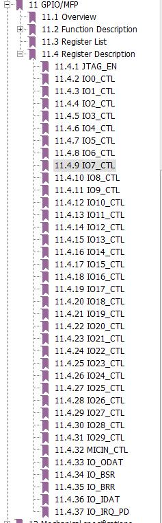
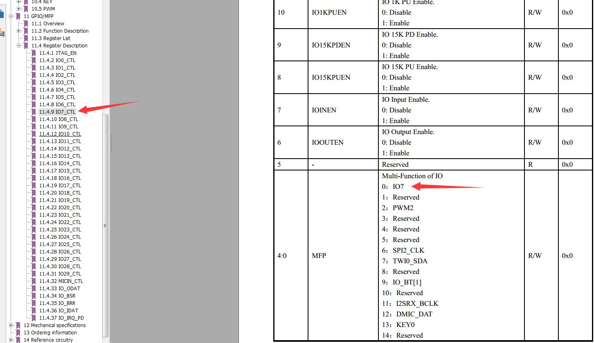

# GPIO 使用说明

## 一、软硬件版本

硬件：方糖电子ATB110X开发板   
软件：SDK版本```ATB110X_SDK_TAG_ZS110A_1910_180724```

## 二、实验目的
实现按键和LED灯的控制，提供基于zephyr下在方糖电子BLE开发板ATB110X下的GPIO使用方法。

## 三、实验步骤
### 1、说明
本实验是基于```peripheral_bas```例程实现。
### 2、实验总体步骤


1. 配置GPIO复用功能
2. binding GPIO设备
3. 配置GPIO参数
4. 使用GPIO
### 3、配置GPIO复用功能
参考```ATB110X Datasheet 1.0.pdf``` 11.4节，关于GPIO寄存器的描述：   
   

对应于代码中的配置在```board_atb110x_dvb_v10.h```板级文件中。   
```c
#define BOARD_PIN_CONFIG	\
	{2, 3 | GPIO_CTL_SMIT | GPIO_CTL_PADDRV_LEVEL(3)},\
	{3, 3 | GPIO_CTL_SMIT | GPIO_CTL_PADDRV_LEVEL(3)},\
	{8, 13 },\
	{9, 13 }, \
	{10, 13 },\
	{11, 13 },\
	{1, 2},
```

其中，上面宏定义中元素的第一项是GPIO引脚序号，第二项即datasheet中GPIO寄存器的配置参数，例如：
如果我们要使用GPIO7，使用普通IO功能，那么配置是```{7,0}```,对应的datasheet为


### binding GPIO设备
```c
	struct device *gpio;

	gpio = device_get_binding("gpio");
	if (!gpio) {
		printk("cannot found device gpio\n");
		return;
	}
```

#### API说明
```c
	struct device *device_get_binding(const char *name)
		Retrieve the device structure for a driver by name.

		Device objects are created via the DEVICE_INIT() macro and placed in memory by the linker. If a driver needs to bind to another driver it can use this function to retrieve the device structure of the lower level driver by the name the driver exposes to the system.

		Return
			pointer to device structure; NULL if not found or cannot be used.
		Parameters
			name: device name to search for.
```

### 配置GPIO为输出模式
```c
	gpio_pin_configure(gpio_dev, 8, GPIO_DIR_OUT | GPIO_POL_INV);
```

### 配置GPIO为输入模式
```c
	ret = gpio_pin_configure(gpio_dev, KEY_1, (GPIO_DIR_IN | GPIO_INT |
	                         GPIO_INT_EDGE | GPIO_INT_ACTIVE_LOW | GPIO_PUD_PULL_UP |
	                         GPIO_INT_DEBOUNCE));

	if (ret)
	{
		printk("Error configuring %d!\n", KEY_1);
	}

```
#### API说明
```c
	static int gpio_pin_configure(struct device *port, u32_t pin, int flags)
		Configure a single pin.

		Return
			0 if successful, negative errno code on failure.
		Parameters
			port: Pointer to device structure for the driver instance.
			pin: Pin number to configure.
			flags: Flags for pin configuration. IN/OUT, interrupt …
```

#### flags
```c
	** GPIO pin to be input. */
	#define GPIO_DIR_IN		(0 << 0)
	
	/** GPIO pin to be output. */
	#define GPIO_DIR_OUT		(1 << 0)
	
	/** @cond INTERNAL_HIDDEN */
	#define GPIO_DIR_MASK		0x1
	/** @endcond */
	
	/** GPIO pin to trigger interrupt. */
	#define GPIO_INT		(1 << 1)
	
	/** GPIO pin trigger on level low or falling edge. */
	#define GPIO_INT_ACTIVE_LOW	(0 << 2)
	
	/** GPIO pin trigger on level high or rising edge. */
	#define GPIO_INT_ACTIVE_HIGH	(1 << 2)
	
	/** GPIO pin trigger to be synchronized to clock pulses. */
	#define GPIO_INT_CLOCK_SYNC     (1 << 3)
	
	/** Enable GPIO pin debounce. */
	#define GPIO_INT_DEBOUNCE       (1 << 4)
	
	/** Do Level trigger. */
	#define GPIO_INT_LEVEL		(0 << 5)
	
	/** Do Edge trigger. */
	#define GPIO_INT_EDGE		(1 << 5)
	
	/** Interrupt triggers on both rising and falling edge. */
	#define GPIO_INT_DOUBLE_EDGE	(1 << 6)
	
	/*
	 * GPIO_POL_* define the polarity of the GPIO (1 bit).
	 */
	
	/** @cond INTERNAL_HIDDEN */
	#define GPIO_POL_POS		7
	/** @endcond */
	
	/** GPIO pin polarity is normal. */
	#define GPIO_POL_NORMAL		(0 << GPIO_POL_POS)
	
	/** GPIO pin polarity is inverted. */
	#define GPIO_POL_INV		(1 << GPIO_POL_POS)
	
	/** @cond INTERNAL_HIDDEN */
	#define GPIO_POL_MASK		(1 << GPIO_POL_POS)
	/** @endcond */
	
	/*
	 * GPIO_PUD_* are related to pull-up/pull-down.
	 */
	
	/** @cond INTERNAL_HIDDEN */
	#define GPIO_PUD_POS		8
	/** @endcond */
	
	/** GPIO pin to have no pull-up or pull-down. */
	#define GPIO_PUD_NORMAL		(0 << GPIO_PUD_POS)
	
	/** Enable GPIO pin pull-up. */
	#define GPIO_PUD_PULL_UP	(1 << GPIO_PUD_POS)
	
	/** Enable GPIO pin pull-down. */
	#define GPIO_PUD_PULL_DOWN	(2 << GPIO_PUD_POS)
	
	/** @cond INTERNAL_HIDDEN */
	#define GPIO_PUD_MASK		(3 << GPIO_PUD_POS)
```

### 配置GPIO为中断输入时，需要添加中断回调函数
```c

void gpio_callback(struct device *port,
                   struct gpio_callback *cb, u32_t pins)
{
    val = ~val;
	printk("%d %d triggered\n", KEY_1, val);
}

void led_key_init(void)
{
	int ret;
	gpio_dev = device_get_binding("gpio");

	if (!gpio_dev)
	{
		{
			printk("cannot found dev gpio \n");
			printk("error\n");
		}
		return;
	}
    
	/* KEY */
	ret = gpio_pin_configure(gpio_dev, KEY_1, (GPIO_DIR_IN | GPIO_INT |
	                         GPIO_INT_EDGE | GPIO_INT_ACTIVE_LOW | GPIO_PUD_PULL_UP |
	                         GPIO_INT_DEBOUNCE));

	if (ret)
	{
		printk("Error configuring %d!\n", KEY_1);
	}

	gpio_init_callback(&gpio_cb, gpio_callback, BIT(KEY_1));
	ret = gpio_add_callback(gpio_dev, &gpio_cb);

	if (ret)
	{
		printk("Cannot setup callback!\n");
	}

	ret = gpio_pin_enable_callback(gpio_dev, KEY_1);

	if (ret)
	{
		printk("Error enabling callback!\n");
	}
}
```

#### API说明
```c
	static void gpio_init_callback(struct gpio_callback *callback, gpio_callback_handler_t handler, u32_t pin_mask)
		Helper to initialize a struct gpio_callback properly.

		Parameters
			callback: A valid Application’s callback structure pointer.
			handler: A valid handler function pointer.
			pin_mask: A bit mask of relevant pins for the handler

	static int gpio_add_callback(struct device *port, struct gpio_callback *callback)
		Add an application callback.
	
		Note: enables to add as many callback as needed on the same port.
	
		Return
			0 if successful, negative errno code on failure.
		Parameters
			port: Pointer to the device structure for the driver instance.
	callback: A valid Application’s callback structure pointer.

	static int gpio_pin_enable_callback(struct device *port, u32_t pin)
		Enable callback(s) for a single pin.

		Note: Depending on the driver implementation, this function will enable the pin to trigger an interruption. So as a semantic detail, if no callback is registered, of course none will be called.

		Return
			0 if successful, negative errno code on failure.
		Parameters
			port: Pointer to the device structure for the driver instance.
			pin: Pin number where the callback function is enabled.
```

### GPIO读写操作
```c
	gpio_pin_write(gpio_dev,LED_1, 0);
	gpio_pin_read(gpio_dev,LED_1, value);
```

#### API说明
```c
	static int gpio_pin_write(struct device *port, u32_t pin, u32_t value)
		Write the data value to a single pin.
	
		Return
			0 if successful, negative errno code on failure.
		Parameters
			port: Pointer to the device structure for the driver instance.
			pin: Pin number where the data is written.
			value: Value set on the pin.

	static int gpio_pin_read(struct device *port, u32_t pin, u32_t *value)
		Read the data value of a single pin.
	
		Read the input state of a pin, returning the value 0 or 1.
	
		Return
			0 if successful, negative errno code on failure.
		Parameters
			port: Pointer to the device structure for the driver instance.
			pin: Pin number where data is read.
			value: Integer pointer to receive the data values from the pin.
```

## 示例源码
源码实现：基于```peripheral_bas```例程实现GPIO0、1、7、8四个引脚的中断输入和输出功能
```c
/* main.c - Application main entry point */

/*
 * Copyright (c) 2018 Actions Semiconductor, Inc
 *
 * SPDX-License-Identifier: Apache-2.0
 */

#include <zephyr/types.h>
#include <stddef.h>
#include <string.h>
#include <errno.h>
#include <misc/printk.h>
#include <misc/byteorder.h>
#include <zephyr.h>

#include <bluetooth/bluetooth.h>
#include <bluetooth/hci.h>
#include <bluetooth/conn.h>
#include <bluetooth/uuid.h>
#include <bluetooth/gatt.h>
#include <bas.h>
#include <gpio.h>

/* trigger low edge */
#define EDGE       (GPIO_INT_EDGE | GPIO_INT_ACTIVE_LOW)  

const u32_t button_pins[] = {0,1, 7, 8};
#define BUTTON_TOTAL sizeof(button_pins)
struct gpio_callback button_cb[BUTTON_TOTAL];

void button_pressed(struct device *gpiob, struct gpio_callback *cb,
		u32_t pins)
{
	printk("pin=%d Button pressed at %d\n", find_lsb_set(pins) - 1, k_cycle_get_32());
}

void button_init(void)
{
	int i;	
	struct device *gpio;

	gpio = device_get_binding("gpio");
	if (!gpio) {
		printk("cannot found device gpio\n");
		return;
	}

	for (i = 0; i < BUTTON_TOTAL; i++) {
		gpio_pin_configure(gpio, button_pins[i],
				GPIO_DIR_IN | GPIO_INT | GPIO_PUD_PULL_UP | EDGE);
		gpio_init_callback(&button_cb[i], button_pressed, BIT(button_pins[i]));
		gpio_add_callback(gpio, &button_cb[i]);
		gpio_pin_enable_callback(gpio, button_pins[i]);
        
//        gpio_pin_configure(gpio, button_pins[i],
//				GPIO_DIR_OUT | GPIO_POL_INV);
//        gpio_pin_write(gpio, button_pins[i], 1);
	}
}


#define DEVICE_NAME		    CONFIG_BT_DEVICE_NAME
#define DEVICE_NAME_LEN		(sizeof(DEVICE_NAME) - 1)

struct bt_conn *default_conn;

static const struct bt_data ad[] = {
	BT_DATA_BYTES(BT_DATA_FLAGS, (BT_LE_AD_GENERAL | BT_LE_AD_NO_BREDR)),
	BT_DATA_BYTES(BT_DATA_UUID16_ALL, 
		0x0f, 0x18, /* bas */
	),
};

static const struct bt_data sd[] = {
	BT_DATA(BT_DATA_NAME_COMPLETE, DEVICE_NAME, DEVICE_NAME_LEN),
};

static void connected(struct bt_conn *conn, u8_t err)
{
	if (err) {
		printk("Connection failed (err %x)\n", err);
	} else {
		default_conn = bt_conn_ref(conn);
		printk("Connected\n");	
	}
}

static void disconnected(struct bt_conn *conn, u8_t reason)
{
	printk("Disconnected (reason %x)\n", reason);

	if (default_conn) {
		bt_conn_unref(default_conn);
		default_conn = NULL;
	}	
}

static struct bt_conn_cb conn_callbacks = {
	.connected = connected,
	.disconnected = disconnected,
};

u8_t bt_ready_flag;
__init_once_text static void bt_ready(int err)
{
	if (err) {
		printk("Bluetooth init failed (err %d)\n", err);
		return;
	}

	bt_ready_flag = 1;
	
	printk("Bluetooth initialized\n");
	
	/* battery service */
	bas_init();
	
	err = bt_le_adv_start(BT_LE_ADV_CONN, ad, ARRAY_SIZE(ad),
			      sd, ARRAY_SIZE(sd));
	if (err) {
		printk("Advertising failed to start (err %d)\n", err);
		return;
	}

	printk("Advertising successfully started\n");
}


void app_main(void)
{
	int err;
    
//    led_key_init();
    button_init();
	printk("button_init\n");

	err = bt_enable(bt_ready);
	if (err) {
		printk("Bluetooth init failed (err %d)\n", err);
		return;
	}

	bt_conn_cb_register(&conn_callbacks);
	
	/* Implement notification. At the moment there is no suitable way
	 * of starting delayed work so we do it here
	 */
	while (1) {
		k_sleep(MSEC_PER_SEC);		

		/* Battery level simulation */
		bas_notify();
	}	
	
}
```

```c
/* board_atb110x_dvb_v10.h */
/*
 * Copyright (c) 2018 Actions (Zhuhai) Technology Co., Ltd
 *
 * SPDX-License-Identifier: Apache-2.0
 */

#define CONFIG_UART_0 1
 
//#define BOARD_PIN_CONFIG	\
//	{2, 3 | GPIO_CTL_SMIT | GPIO_CTL_PADDRV_LEVEL(3)},\
//	{3, 3 | GPIO_CTL_SMIT | GPIO_CTL_PADDRV_LEVEL(3)},\
//	{8, 13 },\
//	{9, 13 }, \
//	{10, 13 },\
//	{11, 13 },\
//	{1, 2},

#define BOARD_PIN_CONFIG	\
	{2, 3 | GPIO_CTL_SMIT | GPIO_CTL_PADDRV_LEVEL(3)},\
	{3, 3 | GPIO_CTL_SMIT | GPIO_CTL_PADDRV_LEVEL(3)}

/* all managed led */
#define LED_CTL_GPIOS			{1,}

/* app led pin */
#define LED_LPOWER_PIN 			    1
#define LED_PAIR_PIN 			    1
#define LED_BTN_PIN 			    1

/* pwm driven led */
#define LED_CTL_PWMS			{1,}
#define LED_LPOWER_PWM   1
#define LED_PAIR_PWM   1
#define LED_BTN_PWM   1
#define LED_PWM   1

#define PWM_CTRL_POL_ACTIVE_HIGH 1

/* key reg val mapping to key val */
#define MXKEYPAD_MASK 0xc6
#define MXKEYPAD_MAPS \
	{0x00020400, 0x00000000, 0x00000000, 	KEY_1},\
	{0x00004000, 0x00020000, 0x00000000,	KEY_2},\
	{0x00800000, 0x04000000, 0x00000000,  KEY_5},\
	{0x00000000, 0x40800000, 0x00000000,  KEY_6},\
	{0x00000000, 0x00000000, 0x00000200,  KEY_7},\
	{0x00000000, 0x00000000, 0x00000080,  KEY_8},\
	{0x00c00000, 0x44840000, 0x00000000,  KEY_9},

/* key val mapping to standard key */
#define KEY_MAPS \
	{KEY_1, 				REMOTE_KEY_POWER,			0xFF},\
	{KEY_2, 				REMOTE_KEY_MENU,							0xFF},\
	{KEY_5,  				REMOTE_KEY_VOL_INC,						0xFF},\
	{KEY_6,  				REMOTE_KEY_VOL_DEC,						0xFF},\
	{KEY_7,  				REMOTE_KEY_BACK,							0xFF},\
	{KEY_8,  				REMOTE_KEY_VOICE_COMMAND,							0xFF},\
	{KEY_9,  	REMOTE_COMB_KEY_OK_BACK,			0xFF},

#define CUSTOMER_CODE 0x10EF
```