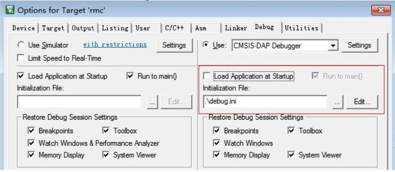
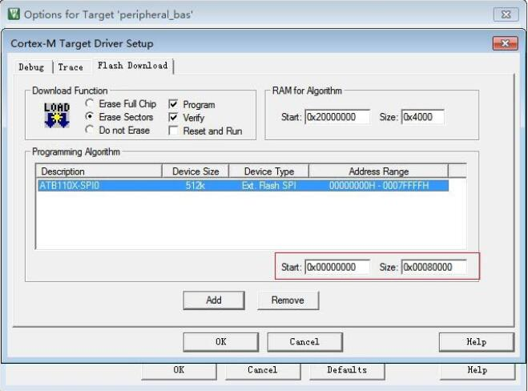
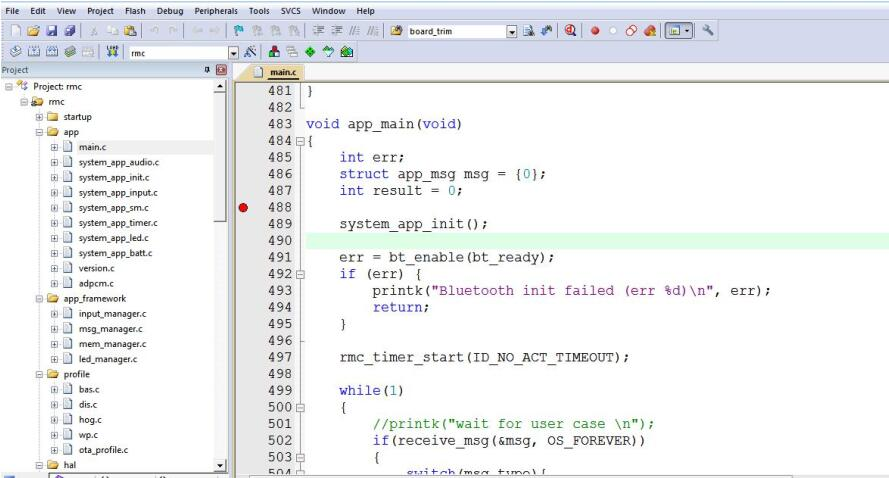

# 在线调试
Keil工具能够正常烧写后， 可通过点击“start/stop debug” 启动在线调试。
在启动调试之前， 需要增改一些配置， 下面以遥控器示例程序为例说明如何在Keil下进行调试。

## 重新烧写loader
用Keil打开loader， 在Options/Utilities/Settings Download Function中选择```Erase Full Chip```、 ```Program```、  ```Verify``` 。 编译成功后， 点击 Keil 界面的```load```按钮进行烧写。   
   

## 配置peripheral_rmc

### 新建debug.ini文件
在peripheral_rmc工程目录下新建一个名为```debug.ini```的配置文件， 文件内容如下:
```c
FUNC void CloseWatchDog (void)
{
_W
DWORD(0x4000401C, 0x20);
} F
UNC void Setup (void)
{
SP = _RDWORD(0x20001000);
PC = _RDWORD(0x20001004);
} C
loseWatchDog();
LOAD .\outdir\rcu.axf INCREMENTAL
Setup();
g,main  
```
说明: rcu.axf是当前工程编译产生的.axf文件。

### 设置debug参数

- Load Application at Startup: 不勾选。
- Run to main:停在main入口: 不勾选。
- Initialization File: 载入debug.ini文件
   

### 修改编程算法地址
打开Keil Options/Utilities/Settings， 点击先前添加的名为ATB110X-SPI0的烧写算法。将起始地址0x20000000修改为0x00000000， size保持不变。   
   

```温馨提示: 调试完成后， 记得将起始地址改回， 方便下次烧写。```

### 设置断点

为方便的控制程序的运行， 可在app_main入口处设置一个断点， 如下图所示:   


### 启动调试
点击“start/stop debug” 启动调试， 点击调试工具栏中的按钮单步调试。