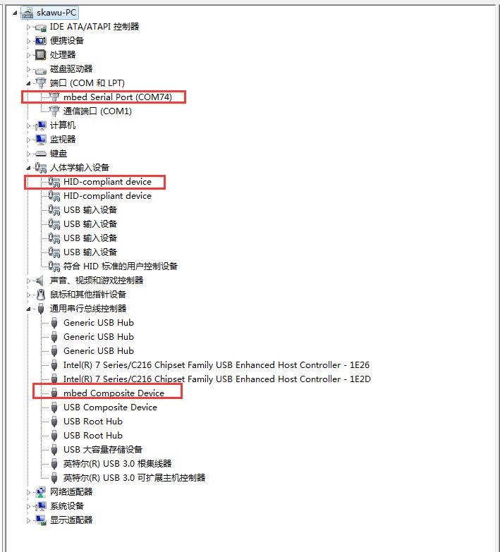
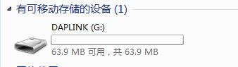

# 开发环境搭建

## 开发工具

   ZS110A方案开发使用 **Keil uVision5 (V5.21)**

## 调试工具
ZS110A EVB板上集成了基于LPC11U35实现的DAPLink（cmsis-dap） ， 支持以下功能：

- Debug ARM Cortex-M SOC
- USB Disk drag and drop programming
- usb-serial

## 开发环境搭建

### 安装必要的驱动

**未连接开发板时PC设备**

   


**使用USB连接开发板和PC后，会出现3个设备**   

   


**若未检测到med Serial Port， 需安装驱动 mbedWinSerial_16466:**
[下载mbed serial port](https://os.mbed.com/handbook/Windows-serial-configuration)


**开发板连接PC后会识别到一个USB大容量存储设备的磁盘卷标名为“DAPLINK”**



### MDK配置

使用DAPLink调试前需要在Keil中完成以下配置：

1. 打开Keil Options/Debug界面
 - Use: 选择 CMSIS-DAP Debugger
 - 设置debug参数
		- Load Application at Startup:不勾选。
		- Run to main:不勾选。
 
		

2. 打开Keil Options/Debug/Settings界面
	- 若设备已连接， 且系统未处于休眠状态：
		- Debug界面内发现DAPLINK；
		- Debug界面内发现Target设备。
	- Connect & Reset Options： 不勾选Reset after Connect。 
	
3. 打开Keil Options/Utilities 界面
	- 选择Use Target Driver For Flash Programming
	- 勾选Use Debug Driver
	- 不勾选Update Target before Debugging   
	

## 固件烧写
打开 sample 例程，编译完成后，按照如下配置烧录参数，点击load即可烧录完成。

### 配置
1. 拷贝KEIL FLM

	将```zs1101\scripts\utils\keil_flash\ATB110X_SPI0.FLM``` 拷贝到``` C:\Keil\ARM\Flash\。```
	
	```注意： 请根据自己Keil安装的路径调整拷贝的路径。```

2. 打开 Keil Options/Utilities/Settings

	- Download Function： 选择“Erase Sectors” “Program” “Verify”   
		```注： 如果只需要擦除， 请只勾选“Erase Sectors” 。```
	- RAM for Algorithm： 按下图配置即可。
	- Programming Algorithm：   
		点击“remove” 删除默认的“New Device 256kB Flash” ， 然后点击“Add” 选择ATB110X-SPI0。 然后编辑Address Range： start配置为0x20000000， size采用默认值。   
	
	

3. 烧写
成功编译代码， 点击Keil工程中的Load即可完成烧写。   
   
系统固件由loader和app构成， 两者需分别烧写， loader只需烧写一次， 当app有修改时只需烧写app那部分即可， 下面以遥控器代码为例说明需要烧写工程的路径：
	- loader: zs110a\samples\voice_rcu\keil5\loader
	- app: zs110a\samples\voice_rcu\keil5\peripheral_rmc
DAPLink和目标设备被Keil检测到是烧写成功的前提， 可在Keil Options/Debug/Settings界面查看， 如下图所示：   
   

当DAPLink没有被识别或设备没有被检测到， 烧写将失败， 一般有如下几个原因：      
1. 开发板开关位置不正确、 跳线和短接帽未连接；   
2. 系统进入deepsleep模式；   
3. Daplink 固件未更新；   
4. mbed驱动未安装。  

解决方法：   
**1. 查看电源是否正常， 开关是否正确， 电源灯是否亮起， Daplink 的SWDIO、 SWCLK跳线是否已经连接上；   
2. 烧写时按住按键， 唤醒系统；   
3. 更新 Daplink 固件， 更新方法：   
	按着板子上 Daplink 按键， 重新连接 USB 上电， 在电脑磁盘下会生成一个可移动磁盘， 删除磁盘里名为fireware.bin的文件， 将新固件拷贝进去(可不改固件名)。 新固件路径:```zs110a\scripts\utils\daplink_firmware\lpc11u35_gl5601_if_crc.bin```；   
4. 安装mbed驱动。**

若系统烧写的固件不幸开启了deepsleep， 但未配置唤醒源(如： KEY中断、 GPIO中断)，   
解决方法： **按下核心板上的reset键， 然后迅速点击Load**；   
```注: 为方便调试可关闭deepsleep， 修改autoconf.h文件 #define CONFIG_DEEPSLEEP 0```

## 运行程序
烧录完成后， 按下reset 按键， 系统将重启。 下面以遥控器代码为例， 观察程序的运行。 重启后串口将有大量数据输出， led1快速闪烁， 按下按键后， 控制台会打印所按下的按键。 如下图所示:   
   
安装```VoiceBleTest_V1.0.x_20xx-xx-xx-debug.apk```(注意安装过程中要打开所有权限， 防止权限不足导致apk无法运行)。 安装完成后打开该apk， 点击```start scan```， 找到名为```BLE_RMC/BLE_YT_RMC```的设备， 点击```connect```对设备发起连接。 连接成功后， 当有按键或语音输入时， 界面会打印该按键或录音   
   
其他常用apk：   
	- nRFConnect-4.6.1.apk   
	- nRF Toolbox-1.18.4.apk   
```注： 以上apk来源网络， 请自行下载。```