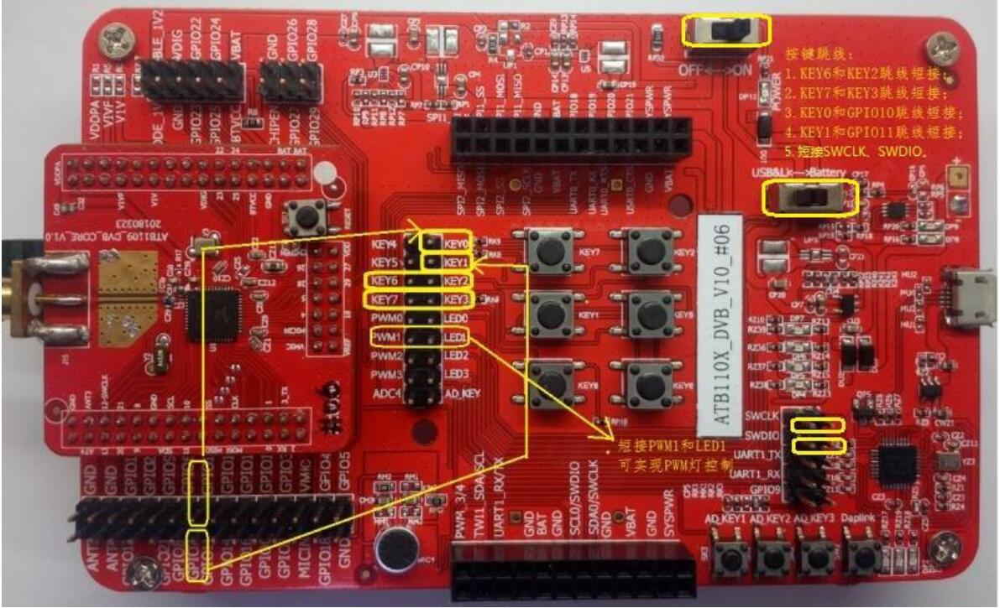

# ATB110X开发板简介
### ATB110X开发板是[深圳方糖电子有限公司](http://cubieboard.org/)基于炬芯科技新一代的低功耗蓝牙芯片ATB110X的开发套件，供用户快速评估学习蓝牙、IoT 等功能开发。

## 硬件资源介绍

### ATB1109
- ARMCortex-M0处理器， 高达96MHz   
- 支持 32MHz晶振    
- 宽电源电压范围 (1.8V至3.6V)   
- TWI*2、 SPI*3、 UART*3、 PWM*5、 I2STX和I2SRX、 IRCTX和RX   
- 支持8 pin 42按键扫描模式   
- Mono Sigma-Delta 语音ADC, 16bit, 16KHz采样率 ,SNR >80dB   
- QFN48 封装；   

### ATB1103
- MCP 4Mbit NORFlash；
- QFN32封装；

### 开发板
- 板载蓝牙天线
- 1路MIC
- 5路PWM
- 4个PWM灯，一个电源指示灯
- 矩阵按键 * 6、AD按键 * 3
- 1个USB口
- 1个红外发射头，1个红外接收头
- 板载daplink
- 1个reset键，一个电源开关，一个电源选择开关
- 两种供电方式: usb、电池

## 软件资源介绍
ATB110X开发板提供完整功能的 SDK 框架供用户参考开发， 并提供大量的使用示例和参考代码。

- 蓝牙语音遥控器示例
- 蓝牙profile示例
- 蓝牙主机、主从示例
- 各个驱动模块示例

## 开发板介绍

开发板由核心板和底板构成， ATB1109和ATB1103核心板可共用该底板。如图所示:

在使用前， 需要对开发板进行一些检查并连接串口:

- DAPLink: 短接SWCLK、 SWDIO。
- 电源: 电源开关选择ON, 电源选择开关选择USB&LK。
- UART: 
 - ATB1109: GPIO2接串口TX， GPIO3接串口RX (UART0)。
 - ATB1103: GPIO5接串口 TX， GPIO4接串口RX (UART1)。

使用语音遥控器标案固件还需做如下设置：

1. 按键
 - KEY3 和 KEY7 短接， KEY2 和 KEY6 短接；
 - KEY1 和 GPIO11 短接， KEY0 和 GPIO10 短接。

2. LED
 - 短接PWM1和LED1。   

如下图所示：
