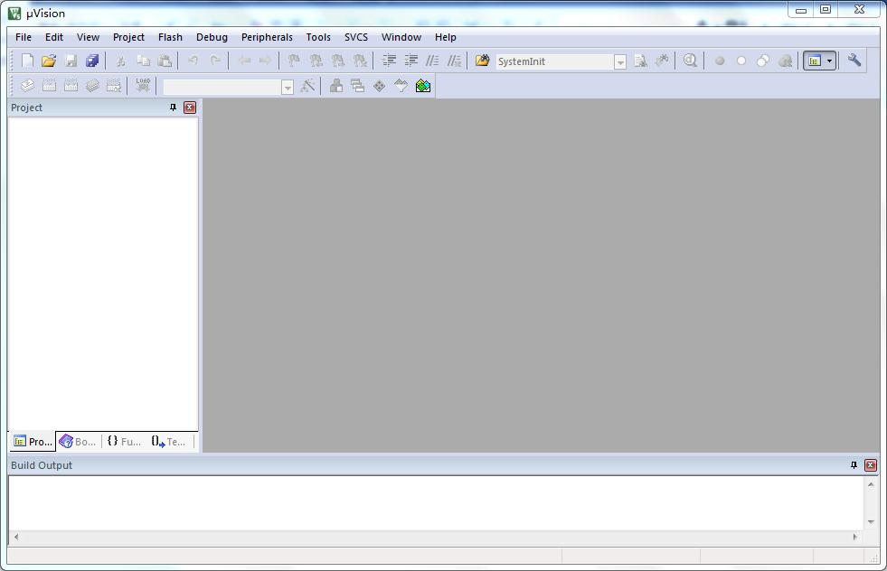
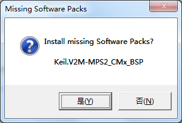
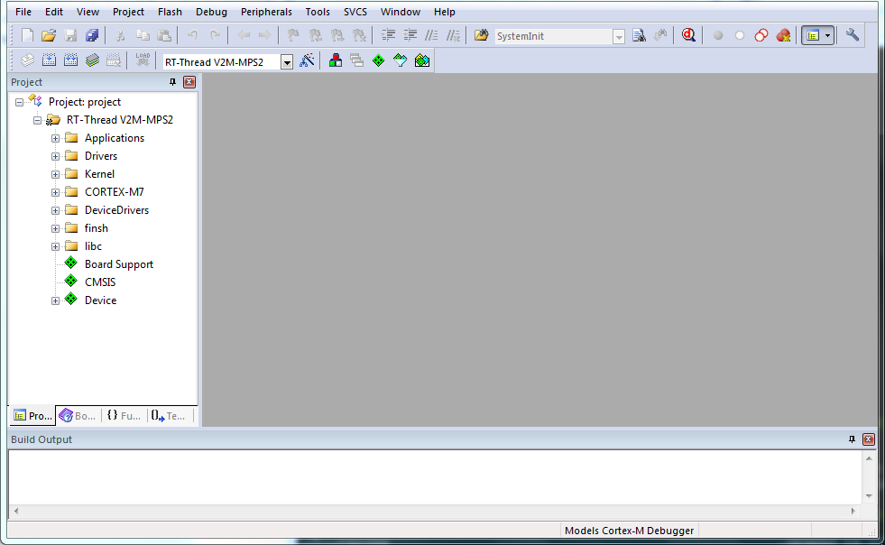
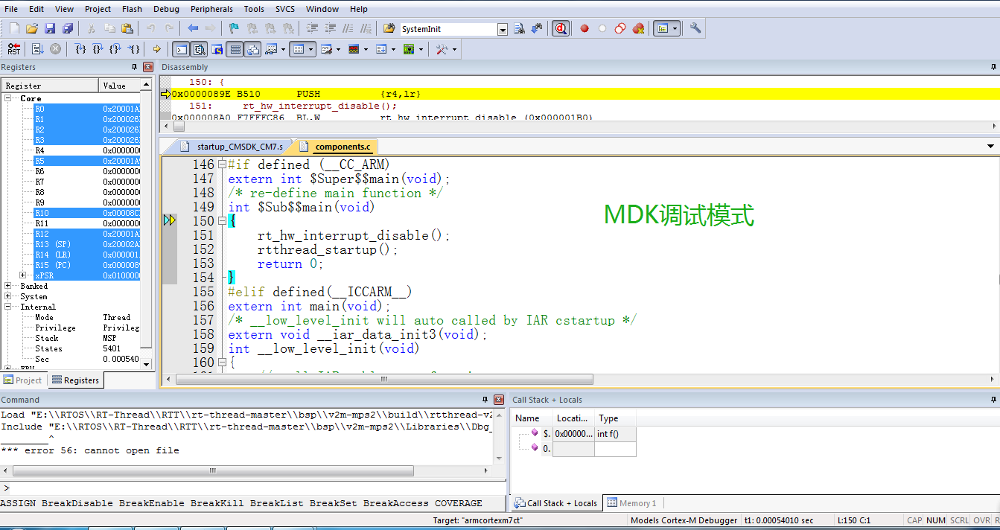
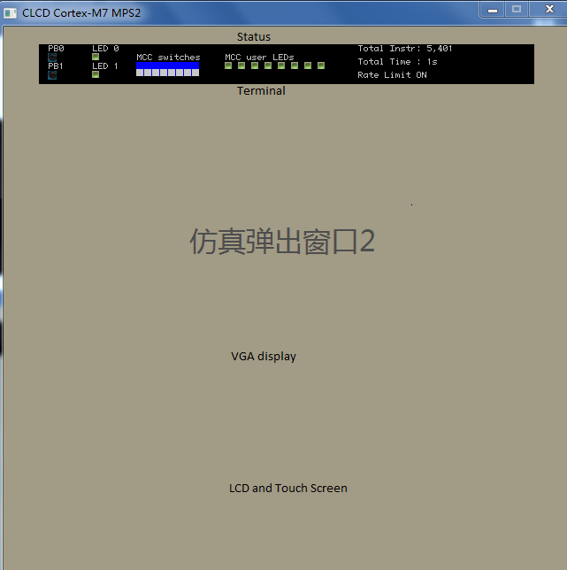
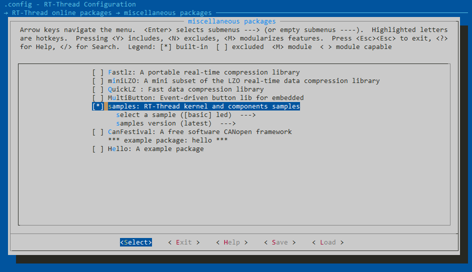
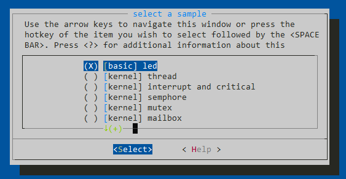
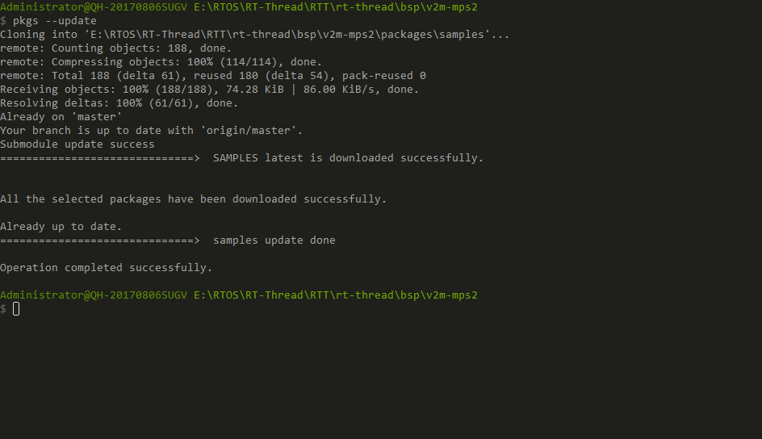
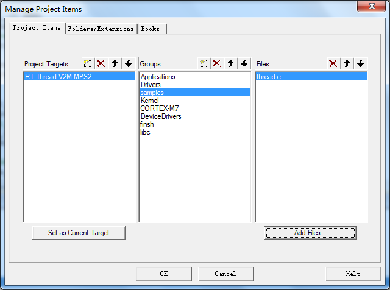

# V2M-MPS2开发环境搭建

## 目的

> 本文的目的是搭建一套不依赖于开发板的RT-Thread运行和调试环境，V2M-MPS2是MDK提供的开发板，配合Fast Models Debugger，就可以不依赖任何硬件，在Cortex-M平台调试代码。

## 步骤及说明

### 下载并安装 MDK-Arm 集成开发环境

下载地址: [MDK-Arm](https://www.keil.com/download/product)

安装并注册软件完成后界面



### 使用V2M-MPS2需要打开windows的telnet客户端

* [Win7打开telnet客户端](https://jingyan.baidu.com/article/eb9f7b6d8701ae869364e826.html)

* [Win10打开telnet客户端](https://jingyan.baidu.com/article/ceb9fb10a9a1b48cad2ba0c4.html)

### 获取 RT-Thread 源码并生成 `bsp/v2m-mps2` 工程

GitHub仓库地址：[RT-Thread](https://github.com/RT-Thread/rt-thread)

使用env工具生成v2m-mps2工程，具体方法参考[RT-Thread官方文档](https://www.rt-thread.org/document/site/rtthread-development-guide/rtthread-tool-manual/env/env-user-manual/)

### 打开工程并实现在线仿真

在 `bsp\v2m-mps2` 目录下双击刚才生成的 `project.uvprojx` 即可打开MDK工程；或者在MDK 界面菜单栏选择 `Project –> Open Project` 选择 `bsp\v2m-mps2` 目录下的 `project.uvprojx` 打开工程。

若是首次使用 V2M-MPS2，会提示安装相应的pack包



保持PC可以联网，点击“是(Y)”即可在线安装 `V2M-MPS2_CMx_BSP` 包。


注：也可下载离线安装包进行安装，下载路径：[V2M-MPS2_CMx_BSP pack包离线下载](http://www.keil.com/dd2/pack/)


pack包安装完成后，工程打开，如下图所示。



确认 `Options for Target` 中 debug 选项是否配置正确（从 GitHub 仓库下载的源码，使用官方 env 工具配置生成的工程默认是配置好的，无需更改）：

确认选择 `Use：Models Cortex-M Debugger`


确认无误后，需要先编译整个工程。点击工具栏的  按钮即可实现工程的全部重新编译。

编译完成后，```Build Output ```窗口输出


`0 Error(s), 0 Warning(s)` 即表示编译成功，没有错误，也没有警告。

下面开始调试仿真，点击调试按钮，如下图所示：


这时 MDK 会进入调试（Debug）模式，并且会弹出两个窗口，如下面所示：






### 仿真运行

点击Run图标 ，或者按键盘 F5，会再弹出一个窗口，此窗口可看到RT-Thread系统输出打印信息：


至此，V2M-MPS2环境已搭建完成！

## samples 例程切换

RT-Thread samples 包提供了多个实验例程供读者进行学习、使用，本节介绍如何切换不同的 samples 例程

### 例程切换说明

* 方法一：在 env 工具中使用 menuconfig 图形化界面切换例程

[注 ： env 工具使用手册](https://www.rt-thread.org/document/site/docs/tools/env/env-user-manual/)

在 `rt-thread\bsp\v2m-mps2` 目录下使用 env 工具的 menuconfig 命令，依次选择：

```{.c}
	RT-Thread online packages  --->
		miscellaneous packages  --->
			[*] samples: RT-Thread kernel and components samples
				select a sample ([basic] led)  --->
				samples version (latest)  --->
```



点击进入 `select a sample ([basic] led)   -->` 选项即可选择所需要的 samples 例程进行切换



配置保存完成后，退出 `menuconfig` 需要使用 `pkgs --update` 命令手动更新所需要的 `packages` 。



如上图所示，操作完成后即可使用 `scons --target=mdk5 -s` 命令重新生成 MDK5 工程，编译运行即可。


* 方法二： 直接添加文件到 MDK 工程

第一步：下载官方[samples 软件包](https://github.com/RT-Thread-packages/samples)获取相关例程代码，或者自己编写测试代码。

第二步：在 MDK 工程中添加所需要的代码文件，如 `thread.c`

点击按钮，打开 `Mangage Project Items` 对话框，添加 `thread.c` 文件。



第三步：编译运行，参考上面[ 仿真运行 ]一节内容。